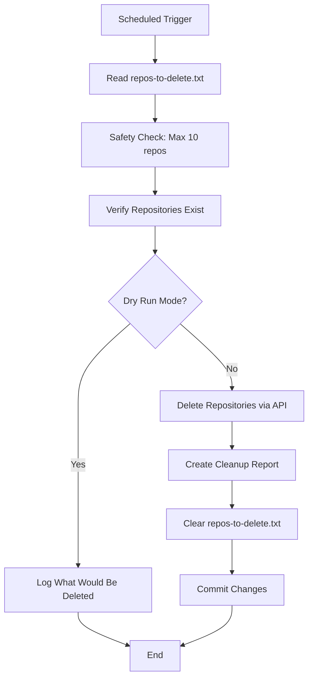

# 🧹 GitHub Repository Cleanup Automation

[](https://creativecommons.org/licenses/by/4.0/)
[](https://github.com/features/actions)
[](https://www.riturajprofile.me)


> Automatically delete specified GitHub repositories using GitHub Actions. Keep your GitHub account clean and organized with scheduled cleanup automation.

**Created by [Rituraj](https://www.riturajprofile.me)**

## ⚠️ Important Warning

**This action permanently deletes repositories and cannot be undone!**

- Repository deletion is **irreversible**
- All code, issues, pull requests, and wikis will be lost
- Always test with dry-run mode first
- Double-check repository names before proceeding

## ✨ Features

- 🤖 **Fully Automated** - Set it and forget it with GitHub Actions
- 📅 **Scheduled Cleanup** - Weekly, daily, or custom schedules
- 🔍 **Dry-Run Mode** - Test without actually deleting anything
- 🛡️ **Safety Limits** - Maximum 10 repositories per run
- ✅ **Verification** - Checks if repositories exist before deletion
- 📊 **Visual Dashboard Reports** - Beautiful ASCII charts showing deletion statistics
- 📈 **Repository Count Tracking** - Shows total repos before and after cleanup
- 📉 **Progress Bars** - Visual representation of deleted vs remaining repos
- 💬 **Smart Commit Messages** - Auto-generated messages with deletion stats
- 🔄 **Auto-Clear List** - Empties the deletion list after successful cleanup

## 🚀 Quick Start

### 1️⃣ Fork or Clone This Repository

```bash
git clone https://github.com/riturajprofile/github-repo-cleanup.git
cd github-repo-cleanup
```

### 2️⃣ Create a Personal Access Token (PAT)

1. Navigate to [GitHub Settings → Developer settings → Personal access tokens → Tokens (classic)](https://github.com/settings/tokens)
2. Click **"Generate new token (classic)"**
3. Give it a name: `Repo Cleanup Action`
4. Set expiration (recommended: 90 days, then rotate)
5. Select the following scopes:
   - ✅ `delete_repo` - Required for deletion
   - ✅ `repo` - Full repository access (if deleting private repos)
6. Click **"Generate token"**
7. **⚠️ Copy the token immediately** - you won't see it again!

### 3️⃣ Add Token to Repository Secrets

1. Go to your repository **Settings**
2. Navigate to **Secrets and variables → Actions**
3. Click **"New repository secret"**
4. Enter details:
   - **Name:** `PAT_TOKEN`
   - **Value:** Paste your personal access token
5. Click **"Add secret"**

### 4️⃣ Configure Repositories to Delete

Edit the `repos-to-delete.txt` file in your repository:

```txt
# Add repositories you want to delete (one per line)
# Format: username/repository-name
# Lines starting with # are comments

riturajprofile/old-project-1
riturajprofile/test-repo-xyz
riturajprofile/archived-assignment-2023
```

### 5️⃣ Test with Dry Run

**Before deleting anything, test first!**

1. Go to the **Actions** tab in your repository
2. Select **"Safe Repository Cleanup"** workflow
3. Click **"Run workflow"** button
4. Select **"true"** for dry run option
5. Click **"Run workflow"**
6. Review the logs to verify everything works correctly

### 6️⃣ Run Actual Cleanup

Once verified:
- Manually trigger with dry_run set to **"false"**, or
- Wait for the scheduled automatic run

## ⚙️ Configuration

### Change Schedule

Edit `.github/workflows/cleanup.yml` and modify the cron expression:

```yaml
on:
  schedule:
    - cron: '0 2 * * 0'  # Every Sunday at 2 AM UTC
```

**Common Schedules:**

| Schedule | Cron Expression | Description |
|----------|----------------|-------------|
| Daily | `'0 2 * * *'` | Every day at 2 AM UTC |
| Weekly (Sunday) | `'0 2 * * 0'` | Every Sunday at 2 AM UTC |
| Weekly (Monday) | `'0 2 * * 1'` | Every Monday at 2 AM UTC |
| Monthly | `'0 2 1 * *'` | First day of month at 2 AM UTC |
| Every 6 hours | `'0 */6 * * *'` | Four times daily |

Use [Crontab Guru](https://crontab.guru/) to create custom schedules.

### Adjust Safety Limit

By default, limited to 10 repositories per run. To change:

Edit `.github/workflows/cleanup.yml` and find:

```yaml
if [ $repo_count -gt 10 ]; then
```

Change `10` to your desired limit (not recommended to exceed 20).

## 📁 Project Structure

```
github-repo-cleanup/
├── .github/
│   └── workflows/
│       └── cleanup.yml          # GitHub Actions workflow
├── reports/                     # Cleanup reports (auto-generated)
│   └── cleanup-YYYYMMDD-HHMMSS.md
├── repos-to-delete.txt          # List of repositories to delete
├── LICENSE                      # CC-BY-4.0 License
└── README.md                    # This file
```

## 🔄 How It Works



**Step-by-Step Process:**

1. **Trigger**: Workflow runs on schedule or manual trigger
2. **Read**: Parses `repos-to-delete.txt` for repository names
3. **Safety Check**: Ensures count doesn't exceed configured limit
4. **Verification**: Confirms repositories exist via GitHub API
5. **Deletion**: Deletes repositories (unless in dry-run mode)
6. **Reporting**: Creates timestamped report in `reports/` folder
7. **Cleanup**: Clears the deletion list
8. **Commit**: Pushes changes back to repository

## 🔐 Security Best Practices

### Token Management
- ✅ Always use GitHub Secrets, never hardcode tokens
- ✅ Use fine-grained tokens with minimum permissions
- ✅ Set token expiration and rotate regularly
- ✅ Audit token usage periodically
- ❌ Never commit tokens to git history

### Safe Usage
- ✅ Always test with dry-run first
- ✅ Start with 1-2 test repositories
- ✅ Verify repository names carefully
- ✅ Keep backups of important code
- ✅ Review logs after each run
- ❌ Don't exceed reasonable batch sizes

## 🐛 Troubleshooting

### Error: "403 Permission denied"

**Causes:**
- PAT missing `delete_repo` permission
- You don't own the repository
- Token has expired

**Solution:**
```bash
# Regenerate token with correct permissions
# Update PAT_TOKEN secret in repository settings
```

### Error: "404 Repository not found"

**Causes:**
- Repository name spelling error
- Wrong format (should be `username/repo-name`)
- Repository already deleted

**Solution:**
```bash
# Verify repository exists:
# https://github.com/riturajprofile/repo-name
# Check format in repos-to-delete.txt
```

### Workflow Doesn't Run

**Causes:**
- Invalid cron syntax
- Workflow disabled
- Repository doesn't have Actions enabled

**Solution:**
```bash
# Check Actions tab → "Safe Repository Cleanup"
# Ensure workflow is enabled (green toggle)
# Verify cron syntax at crontab.guru
```

### "Safety limit exceeded" Error

**Causes:**
- More than 10 repositories in list

**Solution:**
```bash
# Split into multiple runs
# Or increase limit in workflow file
```

## 📊 Example Cleanup Report

After each successful cleanup, a detailed visual report is generated in the `reports/` folder:

```markdown
# 📊 Repository Cleanup Report

**Date**: Sun Nov 10 02:00:00 UTC 2025

## 📈 Dashboard

╔═══════════════════════════════════════════════════════════╗
║                    CLEANUP STATISTICS                     ║
╠═══════════════════════════════════════════════════════════╣
║  Before Cleanup    │ 50 repos                            ║
║  After Cleanup     │ 45 repos                            ║
║  Deleted           │ 5 repos                             ║
║  Failed            │ 0 repos                             ║
╚═══════════════════════════════════════════════════════════╝

┌─────────────────────── VISUAL BREAKDOWN ───────────────────────┐
│                                                                 │
│  Deleted    [█████                                         ]  10%  │
│  Remaining  [█████████████████████████████████████████████]  90%  │
│                                                                 │
└─────────────────────────────────────────────────────────────────┘

## 📊 Summary

| Metric | Count | Percentage |
|--------|-------|------------|
| 📦 Total Before | 50 | 100% |
| ✅ Successfully Deleted | 5 | 10% |
| ❌ Failed to Delete | 0 | - |
| 📦 Total After | 45 | 90% |

## ✅ Successfully Deleted Repositories

```
riturajprofile/old-project-1
riturajprofile/test-repo-xyz
riturajprofile/archived-assignment
riturajprofile/demo-app-2023
riturajprofile/temp-testing
```
```

**Commit Message Example:**
```
Cleanup: Deleted 5 repos | 45 repos remaining [2025-11-10]
```

## 🤝 Contributing

Contributions are welcome! Here's how you can help:

1. **Fork** the repository
2. **Create** a feature branch (`git checkout -b feature/amazing-feature`)
3. **Commit** your changes (`git commit -m 'Add amazing feature'`)
4. **Push** to the branch (`git push origin feature/amazing-feature`)
5. **Open** a Pull Request

### Ideas for Contributions
- Add email notifications
- Implement archive instead of delete
- Add approval workflow
- Support for organization repositories
- Slack/Discord webhook integration

## 📝 License

This work is licensed under a [Creative Commons Attribution 4.0 International License](https://creativecommons.org/licenses/by/4.0/).

You are free to:
- **Share** — copy and redistribute the material in any medium or format
- **Adapt** — remix, transform, and build upon the material for any purpose, even commercially

Under the following terms:
- **Attribution** — You must give appropriate credit to [Rituraj](https://www.riturajprofile.me), provide a link to the license, and indicate if changes were made.

## ⚠️ Disclaimer

**Use at your own risk.** This tool permanently deletes GitHub repositories, which cannot be recovered. The author is not responsible for any data loss. Always:

- Backup important repositories
- Test thoroughly with dry-run mode
- Verify repository names multiple times
- Understand the implications of deletion

## 💡 Tips & Best Practices

### Before Using This Tool
- 📦 Archive repositories instead if you might need them later
- 💾 Clone important repositories locally as backup
- 📸 Export issues, wikis, and discussions if needed
- 🔍 Use GitHub's "Archive" feature for soft deletion

### Maintenance
- 🔄 Rotate PAT tokens every 90 days
- 📊 Review cleanup reports regularly
- 🧪 Test dry-run mode after major changes
- 📋 Keep audit trail of deleted repositories

### Alternatives to Deletion
- **Archive**: Makes repo read-only but preserves history
- **Make Private**: Hides from public but keeps accessible
- **Transfer**: Move to another account/organization
- **Backup**: Clone to local storage before deletion

## 📚 Additional Resources

- [GitHub Actions Documentation](https://docs.github.com/en/actions)
- [GitHub API - Delete Repository](https://docs.github.com/en/rest/repos/repos#delete-a-repository)
- [Managing Personal Access Tokens](https://docs.github.com/en/authentication/keeping-your-account-and-data-secure/managing-your-personal-access-tokens)
- [Crontab Guru - Cron Expression Generator](https://crontab.guru/)

## 🆘 Support

If you encounter issues:

1. Check the [Troubleshooting](#-troubleshooting) section
2. Review [GitHub Actions logs](https://github.com/riturajprofile/github-repo-cleanup/actions)
3. Open an [Issue](https://github.com/riturajprofile/github-repo-cleanup/issues)
4. Start a [Discussion](https://github.com/riturajprofile/github-repo-cleanup/discussions)

## 🌐 Connect with Me

- 🌍 Portfolio: [www.riturajprofile.me](https://www.riturajprofile.me)
- 💼 GitHub: [@riturajprofile](https://github.com/riturajprofile)

## ⭐ Show Your Support

If this project helped you, please consider:
- ⭐ Starring the repository
- 🐛 Reporting bugs
- 💡 Suggesting new features
- 🔀 Contributing code
- 📢 Sharing with others

---

**Made with ❤️ by [Rituraj](https://www.riturajprofile.me) for keeping GitHub accounts clean and organized**

*Remember: With great automation comes great responsibility!* 🕷️